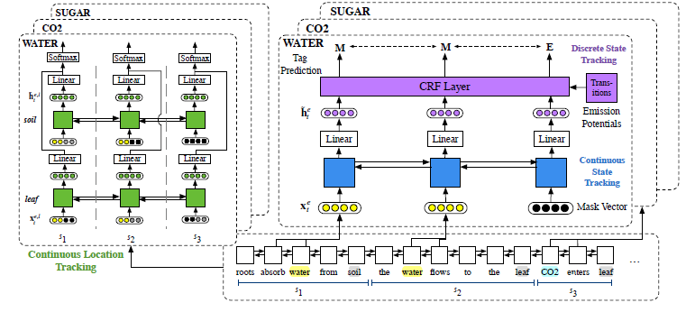
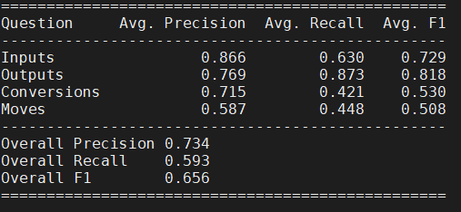

# NCET-ProPara

This is a re-implementation of the Neural CRF Entity Tracking (NCET) model on the [ProPara dataset](http://data.allenai.org/propara/).

NCET is currently holding the state-of-the-art result on the ProPara dataset (by the time I wrote this code, 2019/12). NCET was originally proposed by Aditya Gupta and Greg Durrett, in the paper [*Tracking Discrete and Continuous Entity State for Process Understanding*](https://www.aclweb.org/anthology/W19-1502/) (NAACL 2019 Workshop on Structured Prediction for NLP). However, the authors did not provide the source code, so I wrote my own re-implementation based on the original paper.

## Data

NCET uses the [ProPara dataset](http://data.allenai.org/propara/) proposed by AI2. This dataset is about a reading comprehension task on procedural text, *i.e.*, a paragraph of text that describing a natural process (*e.g.*, photosynthesis, evaporation, etc.). The model are required to read the paragraph and the given entities, then predict the state changes (CREATE, MOVE, DESTROY or NONE) as well as the locations of these entities.


AI2 released the dataset [here](https://docs.google.com/spreadsheets/d/1x5Ct8EmQs2hVKOYX7b2nS0AOoQi4iM7H9d9isXRDwgM/edit#gid=832930347) in the form of Google Spreadsheet. We need three files to run the NCET model, *i.e.*, the Paragraphs file for the raw text, the Train/Dev/Test file for the dataset split, and the State_change_annotations file for the annotated entities and locations. I also provide a copy in CSV format in `data/` directory which is identical to the official release.

**P.S.** Please download the files in CSV format if you choose to download directly from AI2.

## Model

NCET uses a structural framework to perform two sub-tasks of ProPara. For one thing, NCET tracks the state changes of a given entity and predicts its state change sequence. For another, NCET extracts location candidates from the raw text using heuristic rules and predict the most plausible location for each entity and each timestep. 



The base of NCET is a Bi-LSTM with Elmo embeddings to generate context-aware representations for each token. Then, a state tracker and a location predictor are used to perform state tracking and location prediction, respectively. Their inputs are based on the *mention positions* of the given entity, concatenated by the associated verb (for state tracking) or the location candidate (for location prediction). Two sub-tasks are jointly trained and perform inference in a pipeline fashion at test time. For further descriptions, please refer to the original paper.

**P.S.** NCET performs 6-class state prediction (O_C, O_D, C, D, E, M) which is more precise than the original requirements.

## Re-implementation

Since the original paper did not provide all details of the NCET model, there may be differences between my implementation with their intention. To reduce noise from raw data, I perform lemmatization on all entities and location candidates while finding their mention positions in the paragraph. Besides, the way I extract the location candidates and verbs may differ from their paper, please refer to the `data/README.md` and `read_raw_dataset.py` for details.

For joint training, I add the loss of two sub-tasks with a hyper-parameter to weight the two losses. For training period, all timesteps with a valid location are used for optimization. In test time, I only predict those timesteps when the predicted state is CREATE or MOVE. Then, commonsense rules are used to expand the predicted locations to all timesteps. I also use hard constraints to automatically refine the conflicts between state prediction and location prediction, in order to fit the predictions into the evaluation script. Best checkpoint on the dev set is used to evaluate on test set. It is worth noting that the evaluation metric on dev set is the total accuracy of location prediction and state prediction.

## Requirements

PyTorch 1.3.1

Pandas 0.25.3

SpaCy 2.2.3, used in tokenization and lemmatization

flair 0.4.4, used in POS tagging

numpy 1.17.4

allennlp 0.9.0, used in Elmo embedding

pytorch-crf 0.7.2

## Usage

1. [Download](https://docs.google.com/spreadsheets/d/1x5Ct8EmQs2hVKOYX7b2nS0AOoQi4iM7H9d9isXRDwgM/edit#gid=832930347) the dataset or use my copy in `data/`.

2. Download the Elmo options file and weight file provided by Allennlp, and place them under `elmo/` directory:

   ```bash
   wget https://allennlp.s3.amazonaws.com/models/elmo/2x4096_512_2048cnn_2xhighway/elmo_2x4096_512_2048cnn_2xhighway_options.json
   wget https://allennlp.s3.amazonaws.com/models/elmo/2x4096_512_2048cnn_2xhighway/elmo_2x4096_512_2048cnn_2xhighway_weights.hdf5
   ```

   

3. Process the raw text in CSV format into the required input format of NCET:

   ```bash
   python read_raw_dataset.py
   ```

   By default, the files should be put in `data/` and the output JSON files are also stored in `data/`. You can specify the input and output paths using optional command-line arguments. Please refer to the code for more details of cmd args.

   Time for running the pre-process script may vary according to your CPU performance. It takes me about 50 minutes on a Intel Xeon 3.7GHz CPU.

4. Train a NCET model:

   ```bash
   python train.py -mode train -ckpt_dir ckpt -train_set data/train.json -dev_set data/dev.json
   ```

   where `-ckpt_dir` denotes the directory where checkpoints will be stored.

   Some useful optional arguments:

   ```
   -save_mode		Checkpoint saving mode. 'best' (default): only save the best checkpoint on dev set. 'all': save all checkpoints. 'none': don't save checkpoints.
   -epoch			Number of epochs to run the dataset. Default: 100. You can set it to -1 (which was what I did in training) to remove epoch limit and only use early stopping to stop training.
   -impatience		Early stopping rounds. If the score on dev set does not increase for -impatience rounds, then stop the training process. Default: 20. You can set it to -1 to disable early stopping and train for a definite number of epochs.
   -report			The frequency of evaluating on dev set and save checkpoints (per epoch). Default: 2.
   -log_dir		Path to log file. If specified, training and evaluation details will be stored to an additional log. Default: None.
   -loc_loss		The hyper-parameter to weight the state tracking loss and location prediction loss.
   -no_cuda		Only use CPU if specified.
   ```

   Time for training a new model may vary according to your GPU performance as well as your training schema (*i.e.*, training epochs and early stopping rounds). It takes me about 10~15 minutes to train a new model on a single Tesla P40.

5. Predict on test set using a trained model:

   ```bash
   python train.py -mode test -test_set data/test.json -dummy_test data/dummy-predictions.tsv -restore ckpt/best_checkpoint.pt -output data/prediction.tsv
   ```

   where -output is the TSV file that will contain the prediction results, and -dummy_test is the output template that I used to simplify output formatting. The `dummy-predictions.tsv` file is provided by the [official evaluation script](https://github.com/allenai/aristo-leaderboard/tree/master/propara/data/test) of AI2, and I just copied it to `data/`.

6. Download the [official evaluation script](https://github.com/allenai/aristo-leaderboard/tree/master/propara) of ProPara provided by AI2.

7. Run the evaluation script using the gold answer and your prediction:

   ```bash
   python evaluator.py -p data/prediction.tsv -a data/answers.tsv --diagnostics data/diagnostics.txt
   ```

   where `answers.tsv` is the gold answer, and `diagnostics.txt` will contain detailed scores for each instance. `answers.tsv` can be found [here](https://github.com/allenai/aristo-leaderboard/tree/master/propara/data/test), or you can directly use my copy in `data/`. `evaluator.py` is the evaluation script provided by AI2, and can be found [here](https://github.com/allenai/aristo-leaderboard/tree/master/propara/evaluator).

   **P.S.** You should download the whole repo provided by AI2 instead of only downloading `evaluator.py`.

## Results

Using the default hyper-parameters, the re-implemented NCET will reach a total F1 score of 65.0, while the reported score in the original paper was 62.5.

